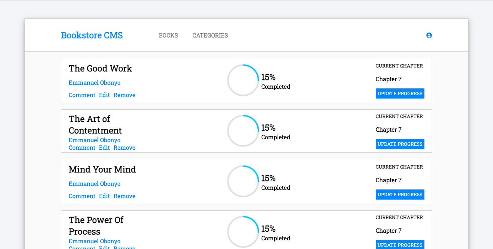

# Book Store App

> A Book CMS (Content Management System) that stores the books that the User is reading along with the Book percentage that they have read.



- A User can Add a Book that they are reading. On Page refresh, the book is fetched from the API and will be added to the list.

## Built With

- JSX, CSS
- React

<!-- ## Live Demo

- [Netlify](https://bookstore-react-redux.netlify.app/) -->

# Set Up
## Clone This Repository
```
$ git clone https://github.com/emmyobonyo/Bookstore.git
$ cd Bookstore
```

## Run Project
```
$ npm install
$ git checkout Add-components
$ npm start
```

👤 **Emmanuel Obonyo**

- GitHub: [@emmyobonyo](https://github.com/emmyobonyo)
- Twitter: [@emmyobonyo](https://twitter.com/emmyobonyo)
- LinkedIn: [Emmanuel Obonyo](https://www.linkedin.com/in/emmanuel-obonyo-3728a2200/)
## 🤝 Contributing

Contributions, issues, and feature requests are welcome!

Feel free to check the [issues page](https://github.com/emmyobonyo/Math-Magiians-Raect/issues).

## Show your support

Give a ⭐️ if you like this project!
